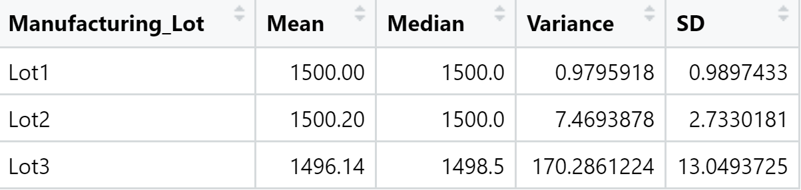

# MechaCar Statistical Analysis
## Summary 
AutosRUs’ newest prototype, the MechaCar, is suffering from production troubles that are blocking the manufacturing team’s progress. AutosRUs’ upper management has called on our team to review the production data for insights that may help the manufacturing team.  We have performed multiple linear regression analysis to identify which variables in the dataset predict the mpg of MechaCar prototypes, collected summary statistics on the pounds per square inch (PSI) of the suspension coils from the manufacturing lots, run t-tests to determine if the manufacturing lots are statistically different from the mean population, and finally designed a statistical study to compare vehicle performance of the MechaCar vehicles against vehicles from other manufacturers. 
### Data
The first dataset is comprised of different design specifications, such as vehicle length, vehicle weight, spoiler angle, drivetrain, and ground clearance.

The second dataset consists of the weight capacities of multiple suspension coils that were tested to determine if the manufacturing process is consistent across production lots.

## Linear Regression to Predict MPG

### Analysis
This linear regression shows that certain variables have more of an impact on MPG due to their low p-values; these variables are vehicle length and ground clearance.
The following variables/coefficients provided a non-random amount of variance to the mpg values in the dataset: vehicle weight, spoiler angle, and drivetrain.
The slope of the linear model is not considered to be zero.  Assuming the significance level of 0.05%, the p-value is 5.35e-11, which is much smaller than the significance level, having enough evidence to reject the null hypothesis.
In summary, the linear model can predict the MPG since the r-squared value is 0.71, meaning 71% of all MPG predictions will be correct when using this linear model.  Further, the p-value is much smaller than 0.05%, which would suggest that the overall slope of our linear model is not zero. 

## Summary Statistics on Suspension Coils

#### Total Summary

#### Lot Summary

### Analysis
The design specifications for the MechaCar suspension coils dictate that the variance of the suspension coils must not exceed 100 pounds per square inch. The current manufacturing data meets the design specifications for all manufacturing lots in total as the variance is 62, which is less than 100.  Two of the three individual lots also meet the design specifications; lot 1 and lot 2 have a variance of 1 and 7, respectively.  Lot 3 individually does not meet the design specifications as its variance is 170.

## T-Tests on Suspension Coils
This t-test will reveal if the suspension coil’s PSI results are statistically different from the mean population results of 1,500 PSI. 

#### All Manufacturing Lots v. Mean PSI of the Population

Since 0.05% is the significance level, the p-value of 0.06 for the PSI of all manufacturing lots is slightly above the significance level, which suggests that the two means are not statistically similar. The test also has a 95% confidence interval of 1497.507-1500.053, which indicates the population mean of 1500 just falls under the 95% confidence interval. 
#### Lot 1 v. Mean PSI of the Population

Since 0.05% is the significance level, the p-value of 1 for the PSI of lot 1 is above the significance level, which suggests that the two means are not statistically similar. The test also has a 95% confidence interval of 1499.719-1500.281, which indicates the population mean of 1500 just falls under the 95% confidence interval. 
#### Lot 2 v. Mean PSI of the Population

Since 0.05% is the significance level, the p-value of 0.6 for the PSI of lot 2 is slightly above the significance level, which suggests that the two means are not statistically similar. The test also has a 95% confidence interval of 1499.423-1500.977, which indicates the population mean of 1500 just falls under the 95% confidence interval. 
#### Lot 3 v. Mean PSI of the Population

Since 0.05% is the significance level, the p-value of 0.04 for the PSI of lot 3 is below the significance level, which suggests that the two means are statistically similar. The test also has a 95% confidence interval of 1492.431-1499.849, which indicates the population mean of 1500 just falls above the 95% confidence interval. 

## Study Design: MechaCar vs Competition
Another statistical study that could be performed is to test if the MechaCar is more fuel efficient than comparable vehicles on the market.

In testing the fuel efficiency of the MechaCar versus their competition (ie cars sold at a simlar price point), a null hypothesis could be whether the MechaCar MPG has the same MPG as the competitor's car.  The alternative hypothesis would be whether the MPG of the MechaCar has greater fuel effiency when compared to the competitor's car. 

The statistical test that should be used to test this hypothesis is an RScript that creates a summary dataframe showing the mean, median, variance, and standard deviation of the automobile's MPG column.  The data needed for this analysis would be as follows: the sales data, MPG levels at different distances, speeds, and weather conditions of both the MechaCar and its competition.  The sample should be random and substantial and reflect which variable, if any, has the most effect on the MPG.  Next, we should write an RScript using the t.test() function to determine if the MPG of the analyzed MechaCar is statistically different from the population mean. Once the analysis is run, if the resulting p-value is smaller than .05, we would reject the null hypothesis.

